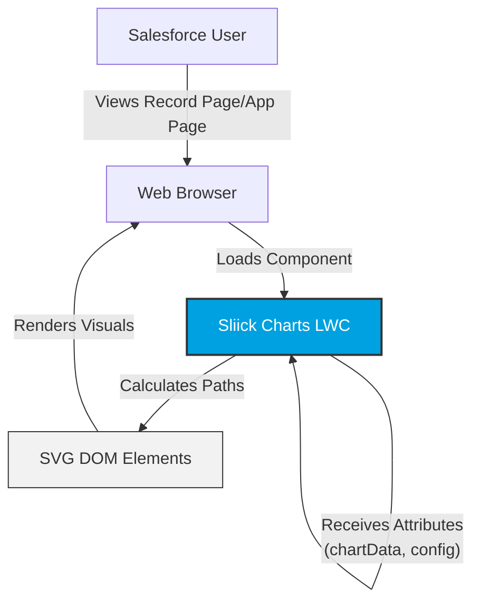

# Sliick Charts

**Sliick Charts** is a powerful, lightweight, and native Lightning Web Component (LWC) library for Salesforce. It allows you to render beautiful, responsive charts (Donut, Pie, Bar, Column, Line, Area) directly within the Salesforce platform using standard SVG technologies—no external libraries required.

## Key Features

- **100% Native**: Built entirely with LWC and SVG. No external scripts (D3, Chart.js, etc.) are loaded.
- **Secure**: Fully compliant with Lightning Web Security (LWS) and Locker Service. Zero external API calls.
- **Customizable**: Configure chart types, sizes, colors, and more directly from the Lightning App Builder or Flow.
- **Types Supported**: Donut, Pie, Bar, Column, Line, Area.

## Installation

### AppExchange

Install the package directly from the [Salesforce AppExchange](https://appexchange.salesforce.com/appxListingDetail?listingId=f99e147a-8c5c-429a-abcc-f6ed99521bdf).

## Usage

### 1. Lightning App Builder

Drag the `Sliick Charts` component onto any Record Page, App Page, or Home Page.

**Configuration Options:**

- **Chart Type**: Select from Donut, Pie, Bar, Column, Line, or Area.
- **Chart Data (JSON)**: Paste your JSON data (e.g., `[{"label":"Sales","value":100,"color":"#0070d2"}]`).
- **Dimensions**: Set `Chart Size` (px) and `Donut Thickness`.
- **Visuals**: Toggle Legends, Grid Lines, Data Points, and more.

### 2. Salesforce Flow

Use the `Sliick Charts` component within Screen Flows to visualize data dynamically. Pass data strings into the `Chart Data (JSON)` input.

### 3. Developer Usage (LWC)

Embed `sliickCharts` in your own custom components.

```html
<c-sliick-charts
  chart-type="Donut"
  chart-data="{myChartData}"
  chart-size="300"
  donut-thickness="50"
  hide-legend="false"
>
</c-sliick-charts>
```

**Data Structure:**

```javascript
this.myChartData = [
  { label: "Q1", value: 30, color: "#0070d2" },
  { label: "Q2", value: 45, color: "#4bca81" },
  { label: "Q3", value: 20, color: "#ffb75d" },
];
```

## Security & Architecture

Sliick Charts is designed with security as a priority:

- **Client-Side Rendering**: All charts are rendered in the browser. No data is sent to any external server.
- **No Apex**: The package contains zero Apex classes, minimizing the server-side footprint.
- **Input Validation**: All color inputs are validated to prevent CSS injection.

## Technical Specifications

### Architecture Overview



### Component Details

| Component      | Type | Namespace | Description                                                  |
| :------------- | :--- | :-------- | :----------------------------------------------------------- |
| `sliickCharts` | LWC  | `sliick`  | Main entry point. Handles data processing and SVG rendering. |

### Data Flow

1. **Input**: Data is received via `chartDataJson` (App Builder/Flow) or the `chartData` array (programmatic).
2. **Processing**: The JavaScript controller validates inputs, sanitizes data, and calculates SVG geometry (arcs, rects, paths).
3. **Rendering**: Computed geometry is bound to the template and rendered as native SVG elements.

## Security Deep-Dive

### External Calls & Storage

- **Zero External Calls**: The application makes **zero** external API calls. No Remote Site Settings or CSP Trusted Sites are required.
- **Zero Persistence**: The application does not create custom objects, settings, or use `localStorage`/`sessionStorage`.

### XSS Prevention

- **Color Validation**: Custom colors are validated against a safe regex `/^[a-zA-Z0-9#(),.%\-\s]+$/` before application to the DOM.
- **Automatic Escaping**: All text labels and titles use standard LWC data binding (`{variable}`) for automatic HTML escaping.

### Compliance

- **LWS & Locker**: Fully compliant with Lightning Web Security and Locker Service.
- **Third-Party Code**: None. The chart logic is custom-built with native SVG. No external libraries (D3, Chart.js) are used.
- **False Positives**: Salesforce Code Analyzer (sf scanner) baseline is 0 violations.

## License

This project is licensed under the Apache License 2.0 - see the [LICENSE](LICENSE) file for details.

Copyright (c) 2026 Sliick. All rights reserved.
